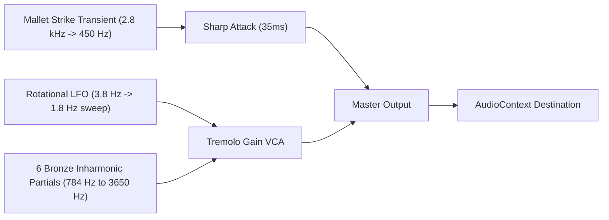

# 🪷 Metta Sutta 31 (31 Realms Metta Sutta Adhitthana)

[](https://react.dev/)
[](https://www.typescriptlang.org/)
[](https://vitejs.dev/)
[](https://tailwindcss.com/)
[](https://developer.mozilla.org/en-US/docs/Web/API/Web_Audio_API)
[](https://opensource.org/licenses/MIT)

> A dedicated Buddhist web application designed for the daily **Adhitthana** (solemn resolve) chanting practice of the **Metta Sutta** (Discourse on Loving-Kindness), recited 31 consecutive times to dedicate loving-kindness sequentially to all **31 Realms of Existence** (*31 Bhumi*).

---

## 📖 Table of Contents

- [Overview](#-overview)
- [Key Features](#-key-features)
- [Chanting Workflow](#-chanting-workflow)
- [Acoustic Engineering (Kyee-zee Sound)](#-acoustic-engineering-kyee-zee-sound)
- [Tech Stack](#-tech-stack)
- [Getting Started](#-getting-started)
- [Project Structure](#-project-structure)
- [Discipline & Reset Rules](#-discipline--reset-rules)
- [Dhamma Dana & License](#-dhamma-dana--license)

---

## 🌟 Overview

In Theravada Buddhist tradition, radiating Metta (loving-kindness) to all living beings brings profound inner peace, protection, and boundless merit. **Metta Sutta 31** provides a structured digital sanctuary for devotees undertaking an **Adhitthana** journey (7, 21, 31, 45, or 90 days), reciting the full Metta Sutta once for each realm, ascending from the lowest woeful realm to the highest Brahma realm.

Inspired by the traditional Burmese **KoeNaWin** spiritual discipline, the app enforces daily consistency: if a calendar day is missed without completing the recitation, the current journey is marked as broken and automatically resets back to Day 1.

---

## ✨ Key Features

### 1. 31 Realms Sequential Recitation Room
- **Guided Realm-by-Realm Flow**: Leads the devotee through all 31 realms (from Hell beings to Maha Brahma), displaying the specific dedication resolution before each recitation of the full Metta Sutta Pali text.
- **Distraction-Free Reading**: Clean, centered, and legible typography displaying the full Pali text without clutter or interruptions.
- **Personalized Concluding Dedication**: Automatically injects the devotee's saved name into the final dedication prayer.
- **Merit Sharing (*Ah-hmya*)**: Concludes with the traditional 3-fold sharing of merits and *Sadhu* affirmations.

### 2. Authentic Synthesized Burmese Kyee-zee (ကြေးစည်သံ)
- **Zero External Audio Files**: Synthesized in real-time purely with the **Web Audio API**. Operates 100% offline with zero network latency.
- **Acoustic Realism**: Recreates the distinctive rotational tremolo / Doppler effect (*"whee... whee... whee..."*) of a traditional Burmese spinning triangular bronze gong, complete with mallet strike transients, inharmonic bronze partials, and exponential decay.
- **Automatic Chimes**: Chimes once upon advancing to the next realm, and strikes 3 resonant chimes during the final merit sharing. Includes an on-demand test button (`🔔 ကြေးစည်သံ`).

### 3. Metta Sutta Stanza Reader (12 Verses)
- **Line-by-Line Phonetics**: Each Pali verse line is paired with Burmese phonetic reading guides in parentheses underneath.
- **Structured Burmese Meanings**: Detailed explanations highlighting the 15 moral conduct requirements (*Charitta*) and systematic loving-kindness radiate categories.
- **English Translations**: Comprehensive English translations provided for every verse.
- **Flexible Controls**: Filter by individual verse (Stanzas 1 through 12) or view all together, with toggleable checkboxes to show or hide phonetics and English translations.

### 4. 31 Realms Cosmology Encyclopedia
- **Cosmological Categorization**: Browse all 31 realms organized by realm category:
  - **Apaya (4 Woeful Realms)**: Hell, Animal, Peta (Hungry Ghosts), Asura
  - **Manussa (1 Human Realm)**
  - **Deva (6 Celestial Realms)**: Catumaharajika, Tavatimsa, Yama, Tusita, Nimmanarati, Paranimmitavasavatti
  - **Rupa-Brahma (16 Fine-Material Realms)**: First Jhana (3), Second Jhana (3), Third Jhana (3), Fourth Jhana (2), Suddhavasa / Pure Abodes (5)
  - **Arupa-Brahma (4 Immaterial Realms)**: Boundless Space, Boundless Consciousness, Nothingness, Neither-Perception-Nor-Non-Perception
- **Instant Search**: Search by Burmese name, Pali name, or dedication text.

### 5. KoeNaWin-Style Strict Calendar & Streak Tracker
- **Calendar Heatmap**: Visual monthly calendar displaying green checkmarks on completed recitation days.
- **Streak Counter**: Tracks unbroken consecutive days of practice.
- **Discipline Archive**: Logs past interrupted or broken journeys with completion dates and reasons to encourage mindfulness and determination.

### 6. Four Benefits of Chanting Metta Sutta
- Highlights the 4 major protective benefits directly on the dashboard:
  1. Waking up in peaceful serenity
  2. Protection from nightmares and bad dreams
  3. Radiant countenance and affection from humans and non-humans
  4. Immunity against nocturnal frights, sleep paralysis, and negative spiritual disturbances

### 7. Serene Light Theme
- Tailored purely in a warm lotus/ivory theme (`#FAF7F2`) with subtle amber borders and high-contrast Burmese typography for an eye-friendly, tranquil reading experience.

---

## 📿 Chanting Workflow

```
[Opening Resolution]
  ├── Namo Tassa Bhagavato Arahato Samma-Sambuddhassa (3 times)
  └── Solemn Intention: "I hereby recite the Metta Sutta once for each realm..."

[Sequential 31 Realms Chanting]
  ├── Realm 1: Hell Beings — Recite Metta Sutta (1 time) 🔔 Kyee-zee Chime
  ├── Realm 2: Animal Realm — Recite Metta Sutta (1 time) 🔔 Kyee-zee Chime
  ├── ...
  └── Realm 31: Maha Brahma Realm — Recite Metta Sutta (1 time) 🔔 Kyee-zee Chime

[Concluding Dedication]
  └── Devotee name auto-injected into the final dedication prayer

[Merit Sharing (Ah-hmya)]
  ├── May all beings share in this wholesome deed...
  └── Sadhu... Sadhu... Sadhu...! 🔔 3 Resonant Kyee-zee Strikes
```

---

## 🔔 Acoustic Engineering (Kyee-zee Sound)

The Burmese Kyee-zee (ကြေးစည်) is an equilateral triangular flat bronze plate suspended by a cord. When struck with a wooden stick, it spins freely, creating a rhythmic amplitude and frequency modulation (rotational Doppler effect).



- **Frequency Spectrum**:
  - Fundamental: G5 (784.0 Hz) with detuned bronze harmonic partials at 1176 Hz (1.5x), 1568 Hz (2.0x), 2156 Hz (2.75x), 2820 Hz (3.6x), and 3650 Hz (high shimmer).
- **Rotational Doppler Tremolo**:
  - A sine LFO sweeps dynamically from 3.8 Hz down to 1.8 Hz over 5.5 seconds to simulate the slowing angular velocity of the spinning cord.

---

## 🛠 Tech Stack

| Technology | Purpose |
|---|---|
| **React 19** | Component architecture & state management |
| **TypeScript** | Type-safe models, props, and cosmological schemas |
| **Vite 6** | Instantaneous HMR and optimized production bundling |
| **Tailwind CSS v4** | Modern utility-first styling with custom typography |
| **Lucide React** | Clean, accessible vector icons |
| **Web Audio API** | Pure acoustic synthesis for zero-latency offline Kyee-zee chime |
| **LocalStorage** | Client-side persistence for streak records and strict date checks |

---

## 🚀 Getting Started

### Prerequisites
- [Node.js](https://nodejs.org/) (Version 18 or higher)
- `npm` (comes with Node.js) or `pnpm` / `yarn`

### Installation & Run

1. Clone or download the repository:
   ```bash
   cd metta-sutta
   ```

2. Install dependencies:
   ```bash
   npm install
   ```

3. Start the development server:
   ```bash
   npm run dev
   ```

4. Open your browser and navigate to:
   ```
   http://localhost:5173/
   ```

### Production Build
To create an optimized, minified production build:
```bash
npm run build
npm run preview
```

---

## 📁 Project Structure

```
metta-sutta/
├── index.html                  # HTML entry point (Noto Sans Myanmar & Padauk fonts)
├── package.json                # Project dependencies and build scripts
├── tsconfig.json               # TypeScript configuration
├── vite.config.ts              # Vite configuration
├── public/
│   └── lotus.svg               # App icon
└── src/
    ├── main.tsx                # React application root mount
    ├── App.tsx                 # Navigation routing & state coordinator
    ├── index.css               # Tailwind CSS & global typography rules
    ├── types/
    │   └── index.ts            # Type definitions (RealmItem, MettaVerse, AdhitthanaState)
    ├── data/
    │   ├── realmsData.ts       # Detailed data & dedications for all 31 realms
    │   └── mettaSuttaData.ts   # Full Pali text, phonetics, Burmese meanings, and English (12 verses)
    ├── services/
    │   ├── soundService.ts     # Web Audio API Kyee-zee synthesizer
    │   └── storageService.ts   # LocalStorage & KoeNaWin discipline calendar evaluator
    └── components/
        ├── Navbar.tsx          # Top navigation bar, streak badge, settings modal trigger
        ├── HomeView.tsx        # Dashboard, day counter, progress bar, 4 benefits card
        ├── RecitationRoom.tsx  # Distraction-free 31 realms sequential chanting room
        ├── SuttaReader.tsx     # 12 verses study room (Pali, phonetics, Burmese, English)
        ├── RealmsCatalog.tsx   # 31 realms cosmology guide with category tabs & search
        ├── HistoryCalendar.tsx # Monthly calendar heatmap & broken journey archive
        └── SettingsModal.tsx   # Devotee name input & journey reset options
```

---

## ⚖️ Discipline & Reset Rules

- **Unbroken Daily Recitation**: Adhitthana requires unwavering consistency. If an entire calendar day elapses without completing the daily 31-realm recitation, the application triggers a strict reset.
- **Day 1 Reset**: The journey status flips to `missed_day`. Once acknowledged, the current streak resets to 0, and the journey restarts from Day 1.
- **Audit Archive**: The broken journey is preserved in the `failedJourneys` history log with its start date, failure date, and completed day count to maintain self-accountability.

---

## 🪷 Dhamma Dana & License

This project is created as an act of **Dhamma Dana** (gift of the Dhamma) for Buddhist practitioners, meditators, and devotees worldwide. 

May all merit accrued from developing and utilizing this application be shared with all living beings across the 31 realms of existence. May all beings be free from suffering, free from hatred, and endowed with boundless peace and happiness.

This project is licensed under the [MIT License](LICENSE).

**Sadhu... Sadhu... Sadhu...!**
